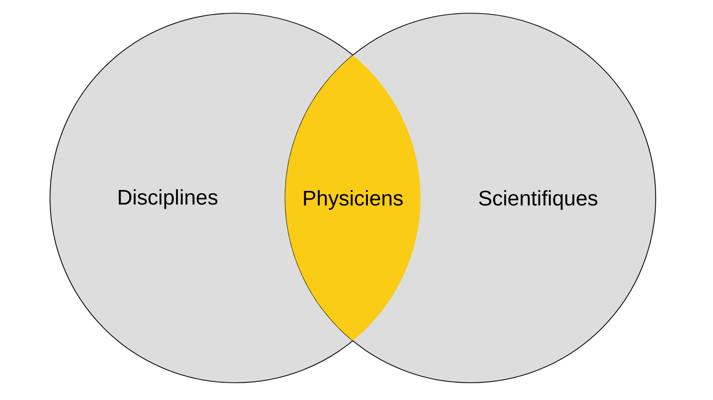
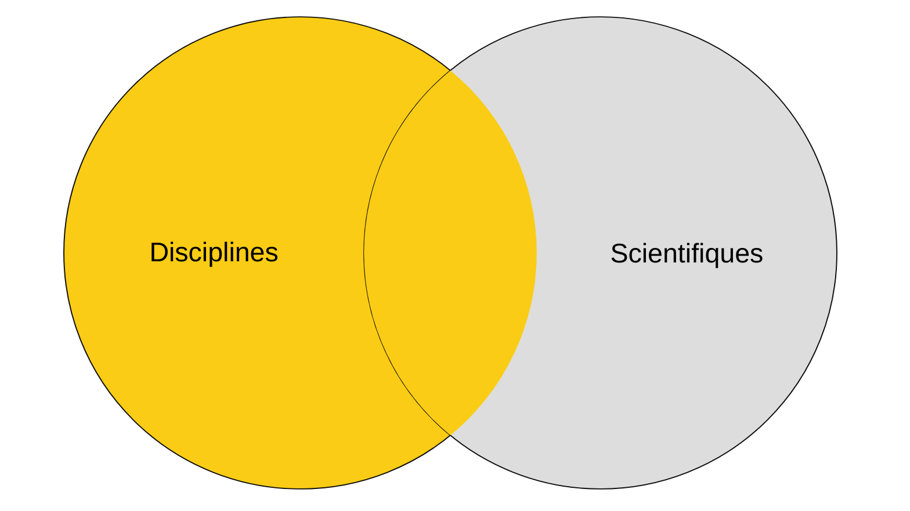
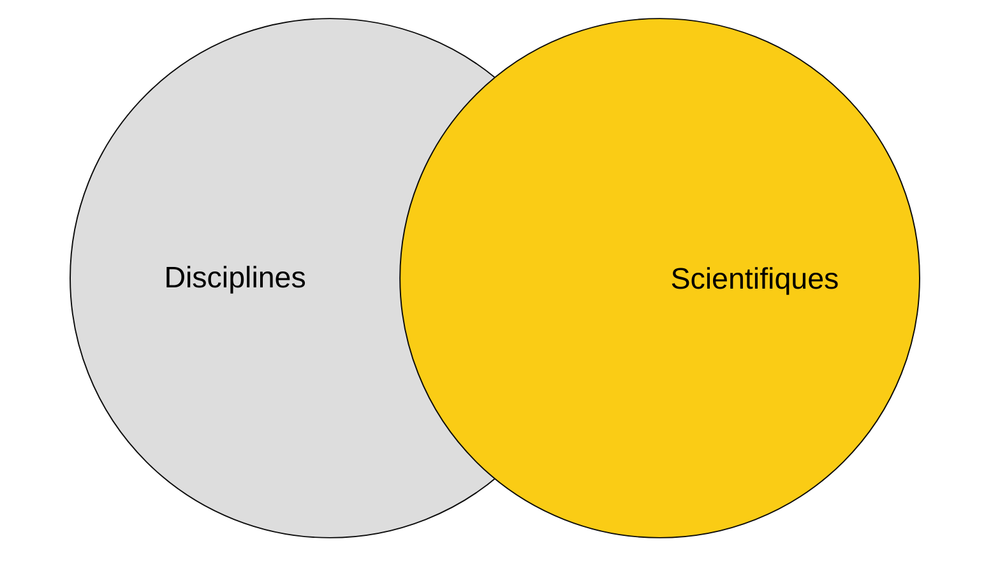
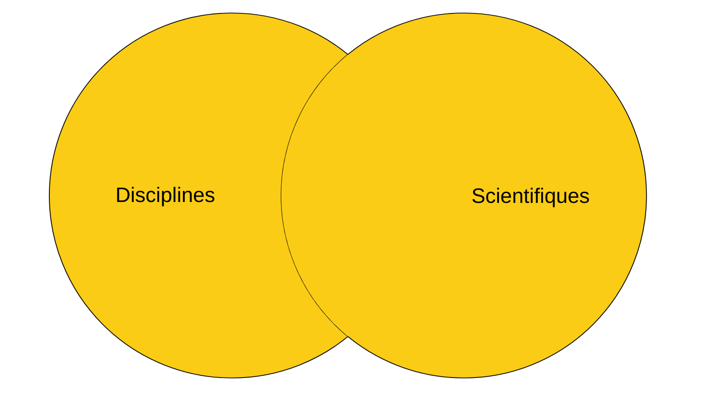

Nous avons précédemment abordé les commandes SQL, en les répartissant en 5 sous-catégories, de la gestion de la structure de la base de données à la manipulation des données en passant par la gestion des droits d'accès. Il est temps de nous intéresser à d'autres notions, qui sont souvent utilisées par les développeurs : les jointures et les sous-requêtes.

## Les jointures

Il est assez rare qu’on utilise une table seule dans une base de données. En effet, une table contient généralement des informations sur un seul type d’objet, et il est donc rare d’y trouver à elle seule toutes les données recherchées. Si c’est le cas, c’est souvent le signe d’un modèle de données mal conçu, qui ne respecte pas les principes de normalisation et d’atomicité.

Bien entendu, les créateurs du SQL ont pensé à ce type de cas de figure, et ont créé un moyen de lier les tables entre elles : les jointures. Globalement, une jointure permet de rapprocher les données de plusieurs tables à partir des relations qui les lient.

Reprenons l'exemple des scientifiques et de leurs publications, et complexifions-le. Mon application gère des publications scientifiques, et permet de retrouver les travaux menés par des scientifiques, parfois en collaboration. On aura donc les tables suivantes :

- scientifiques (id, nom, prenom, date_naissance, ...)
- publications (id, titre, resume, ...)
- auteurs (id_publication, id_scientifique)

Ces tables définissent des entités. Les clés étrangères (ou *Foreign Key*, d'où les `FK` sur le schéma suivant) définissent des relations  `One to many` (entre scientifiques et disciplines). La table scientifique_publication matérialise quant à elle une relation `Many to many` entre scientifiques et publications. Dans notre cas, c'est la seule table qui ne représente pas une entité.


Les jointures vont émerger du besoin de relier les informations entre elles, par exemple pour savoir à quelles publications des physiciens allemands ont participé en physique entre 1900 et 1930. On recherche des noms de scientifiques, en lien avec une discipline et des publications.

La requête SQL demandée pourrait être la suivante :

```sql
SELECT *
FROM Scientifiques AS s
INNER JOIN Publication_scientifique AS ps ON s.Id = ps.Id_scientifique
INNER JOIN Publications AS p ON ps.Id_publication = p.Id
INNER JOIN Disciplines AS d ON s.Discipline_id = d.Id
WHERE s.Pays = 'Allemagne'
  AND d.Nom = 'Physique'
  AND p.Date_publication BETWEEN '1900-01-01' AND '1930-12-31';
```

On remarque plusieurs éléments intéressants dans la requête :

- l'étoile (`*`) qui permet de récupérer l'ensemble des colonnes des tables impliquées (attention aux performances sur des tables contenant beaucoup de données).
- l'utilisation des alias (`s`, `ps`, `p`, `d`) définis avec le mot-clé `AS`. Ils permettent d'alléger la syntaxe des requêtes, sachant qu'on peut vite monter un une bonne cinquantaine de lignes voire plus encore.

On peut schématiser la requête SQL ci-dessus ainsi :


Il existe plusieurs types de jointures, selon les ensembles de données que l'on souhaite récupérer. Dans les schémas suivants, les ensembles jaunes représenteront les données remontées par la requête, les ensembles gris les données non remontées.

- `INNER JOIN` : ne retourne que les lignes qui ont une correspondance dans les deux tables. Autrement dit, il s'agit de l'intersection des deux tables.



- `LEFT JOIN` : retourne toutes les lignes de la table de gauche, et les lignes correspondantes de la table de droite.



- `RIGHT JOIN` : retourne toutes les lignes de la table de droite, et les lignes correspondantes de la table de gauche. C'est un LEFT JOIN dont on a inversé les tables.



- `FULL OUTER JOIN` : retourne toutes les lignes des deux tables.



Pour avoir pratiqué un moment le SQL, les jointures les plus utilisées sont `INNER JOIN` et `LEFT JOIN`. `RIGHT JOIN` et `FULL OUTER JOIN` sont plus rares, mais peuvent s'avérer utiles dans certains cas.

## Les sous-requêtes

Une sous-requête est une requête imbriquée dans une autre requête. Elle permet de découper la logique d'une grande requête en plusieurs étapes, rendant le code plus lisible.

Reprenons notre base de données et imaginons que l'on cherche à en extraire des informations de manière plus complexes. Par exemple, imaginons que l'on cherche à trouver les scientifiques qui ont participé à plus de 5 publications. On pourrait utiliser la requête suivante :

```sql
SELECT *
FROM scientifiques AS s
WHERE s.id IN (
    SELECT id_scientifique
    FROM auteurs
    GROUP BY id_scientifique
    HAVING COUNT(*) > 5
);
```

On récupère dans un premier temps les scientifiques ayant publié plus de 5 articles grâce à la requête suivante :

```sql
SELECT id_scientifique
FROM auteurs
GROUP BY id_scientifique
HAVING COUNT(*) > 5;
```

Sur des requêtes légères ont peut travailler avec des sous-requêtes, mais quand une sous-requête est complexe mais n'a pas d'utilité à être transformée en table, on peut travailler avec les CTE, Common Table Expression.

## Les CTE

Le principe des CTE (Common Table Expression) est de définir une table temporaire, qui sera utilisée comme base de travail pour une autre requête. Cette table temporaire sera utilisée dans l'autre requête au même titre qu'une table. La structure de base d'une CTE est la suivante :

```sql
WITH scientifiques_allemands AS (
	SELECT *
	FROM scientifiques AS s
		INNER JOIN publications AS p ON s.id_publication = p.id
		INNER JOIN disciplines AS d ON p.id_discipline = d.id
	WHERE s.pays = 'Allemagne'
		AND d.nom = 'Physique'
)
SELECT *
FROM scientifiques_allemands
WHERE Date_publication BETWEEN '1900-01-01' AND '1930-12-31';
```

L'exemple que je donne ici complique volontairement les choses, et est juste fait pour vous expliquer le principe. On a vu plus haut que la même chose peut être réalisée avec une jointure et un WHERE. Il faut bien vous imaginer qu'une requête SQL peut faire plusieurs dizaines de lignes, avec un grand nombre de jointures, des conditions complexes etc. Et dans ce cas là, les CTE permettent de rendre le code plus lisible, et plus facile à maintenir.

Quand une requête complexe a besoin d'être stockée en base de données, afin de pouvoir accéder en permanences aux données qu'elle produit, on utilise un nouvel objet SQL, une vue.

## Les vues

Une vue c'est une table virtuelle, basée sur une requête SQL, qui s'appuie généralement sur les données de plusieurs autres tables. Si on reprend notre exemple, on peut créer une vue contenant tous les résultats de la requête précédente :

```sql
-- Création d'une vue
CREATE VIEW scientifiques_allemands AS
SELECT *
FROM scientifiques AS s
	INNER JOIN publications AS p ON s.id_publication = p.id
	INNER JOIN disciplines AS d ON p.id_discipline = d.id
WHERE s.pays = 'Allemagne'
	AND d.nom = 'Physique';
```

Une fois qu'une vue est créée, on peut l'utiliser de la même manière qu'une table (en terme de récupération de données). En général, on spécifie en début de requête quels champs de chaque table on souhaite récupérer, et on les nomme si besoin. Par exemple, dans le cas présent, on pourrait souhaiter récupérer seulement le nom et le prénom des scientifiques, ainsi que le titre de leurs publications.

```sql
CREATE VIEW scientifiques_allemands AS
SELECT s.nom, s.prenom, p.titre
FROM scientifiques AS s
	INNER JOIN publications AS p ON s.id_publication = p.id
WHERE s.pays = 'Allemagne';
```

Dans cette vue, on récupère seulement 3 champs au lieu de la totalité des champs des 3 tables dans le cas précédent.

Une fois la vue créée, on peut l'utiliser de la même manière qu'une table : 

```sql
SELECT * FROM scientifiques_allemands
WHERE prenom LIKE 'Albert%';
```

Bien entendu, on ne peut pas faire d'`UPDATE`, d'`INSERT` ou de `DELETE` sur une vue, car ce n'est qu'une table virtuelle. C'est sur les tables d'origine que se font les modifications, de création ou de suppression.

Les vues, les CTE, les jointures, ce sont des moyens de récupérer des données, mais pour récupérer des données il faut des opérateurs. Découvrons maintenant les opérateurs qui vous permettront de filtrer les données.

## Encore des opérateurs

Jusqu'à présent je vous ai présenté les mots clés de base du SQL, mais il en existe un très grand nombre. On peut d'ailleurs les diviser en plusieurs catégories : 

- Opérateurs arithmétiques 
- Opérateurs de comparaison
- Opérateurs logiques 
- Opérateurs de recherche 

### Les opérateurs arithmétiques

Vous les connaissez déjà, il s'agit des opérateurs d'addition `+`, de soustraction `-`, de multiplication `*` et de division `/`. Leur sens est le même en SQL que dans la vie courante, pas de difficultés de ce côté.

### Les opérateurs de comparaison

Vous les connaissez déjà pour la plupart, il s'agit des opérateurs d'égalité `=`, d'inégalité `<`, `>`, `<=` (inférieur ou égal), `>=` (supérieur ou égal), auxquels on rajoute deux opérateurs de différence `!=` et `<>`. Ces deux derniers opérateurs sont équivalents, selon le SGBD c'est l'un ou l'autre qui sera utilisé.

### Les opérateurs logiques

Si vous avez déjà fait un peu de code, vous les reconnaîtrez, sauf qu'au lieu d'utiliser des `&&`, `||` et autres `!` on utilise des mots clés : 

- `AND` (et) : dans une clause WHERE on l'utilise pour vérifier que deux conditions sont respectées ensemble.

```sql
-- On cherche ici les scientifiques dont le pays est "Allemagne" et dont l'année de naissance est comprise entre 1900 et 1930
SELECT *
FROM scientifiques
WHERE pays = 'Allemagne' AND date_naissance BETWEEN '1900-01-01' AND '1930-12-31';
```

- `OR` (ou) : dans une clause WHERE on l'utilise pour vérifier qu'au moins une des conditions est respectée.

```sql
-- On cherche ici les scientifiques dont le pays est "Allemagne" ou "France"
SELECT *
FROM scientifiques
WHERE pays = 'Allemagne' OR pays = 'France';
```

- `NOT` (non) : dans une clause WHERE on l'utilise pour inverser le sens d'une condition.

```sql
-- On cherche ici les scientifiques dont le pays n'est pas "Allemagne" ou "France"
SELECT *
FROM scientifiques
WHERE pays NOT IN ('Allemagne', 'France');
```

### Les opérateurs de recherche

Récupérer des données nécessite de pouvoir faire diverses vérifications, que ce soit sur des plages de dates, des chaînes de caractères, sur des valeurs etc. Les opérateurs de recherche sont là pour ça :

- `LIKE` : permet de vérifier si une chaîne de caractères correspond à un modèle. On peut utiliser des jokers, comme `%` pour représenter n'importe quelle séquence de caractères, et `_` pour représenter un seul caractère.

```sql
-- On cherche ici les scientifiques dont le nom commence par "Einstein"
SELECT *
FROM scientifiques
WHERE nom LIKE 'Einstein%';
```
La position du `%` détermine l'endroit ou on ne cherche pas quelque choses de spécifique. `%` devant signifie "n'importe quoi avant", `%` derrière signifie "n'importe quoi après" et `%nst%` signifie "n'importe quoi avant et n'importe quoi après".

- `NOT LIKE` : permet de vérifier si une chaîne de caractères ne correspond pas à un modèle.

```sql
-- On cherche ici les scientifiques dont le nom ne commence pas par "Einstein".
SELECT *
FROM scientifiques
WHERE nom NOT LIKE 'Einstein%';
```

- `BETWEEN` : permet de vérifier si une valeur se trouve dans un intervalle (inclusif).

```sql
-- On cherche ici les scientifiques nés entre 1900 et 1930.
SELECT *
FROM scientifiques
WHERE date_naissance BETWEEN '1900-01-01' AND '1930-12-31';
```

- `NOT BETWEEN` : permet de vérifier si une valeur se trouve hors d'un intervalle (exclusif).

```sql
-- On cherche ici les scientifiques dont l'année de naissance n'est pas comprise entre 1900 et 1930.
SELECT *
FROM scientifiques
WHERE date_naissance NOT BETWEEN '1900-01-01' AND '1930-12-31';
```

- `IN` : permet de vérifier si une valeur se trouve dans une liste de valeurs.

```sql
-- On cherche ici les scientifiques dont le pays est "Allemagne" ou "France".
SELECT *
FROM scientifiques
WHERE pays IN ('Allemagne', 'France');
```

- `NOT IN` : permet de vérifier si une valeur ne se trouve pas dans une liste de valeurs.

```sql
-- On cherche ici les scientifiques dont le pays n'est pas "Allemagne" ou "France".
SELECT *
FROM scientifiques
WHERE pays NOT IN ('Allemagne', 'France');
```

- `IS NULL` : permet de vérifier si une valeur est nulle.

```sql
-- On cherche ici les scientifiques dont la date de naissance est nulle.
SELECT *
FROM scientifiques
WHERE date_naissance IS NULL;
```

- `IS NOT NULL` : permet de vérifier si une valeur n'est pas nulle.

```sql
-- On cherche ici les scientifiques dont la date de naissance n'est pas nulle
SELECT *
FROM scientifiques
WHERE date_naissance IS NOT NULL;
```

### Opérateurs hors catégories

Pour les derniers opérateurs que je vous présenterai je ne tenterai pas de les classifier, car on arrive sur des mots-clés pour lesquels un mot-clé constitue une catégorie à lui seul.

- `CASE WHEN` : permet de calculer un résultat en fonction de la valeur d'un champ ou d'une condition. En gros, il s'agit de faire un "si ... alors ... sinon ..." en SQL.

```sql
-- On utilise CASE WHEN pour ajouter un champ 'rang' à notre sélection, qui sera 'premier' pour les 3 scientifiques les plus cités, et 'autre' pour les autres.
SELECT *, CASE WHEN nb_citations >= 3 THEN 'premier' ELSE 'autre' END AS rang
FROM scientifiques;
```

Cela permet de retranscrire des champs de type BIT ou BOOLEAN avec un libellé, par exemple 'oui'/'non'.

- `DISTINCT` : permet de sélectionner les valeurs uniques d'un champ. Il permet de supprimer les doublons dans un SELECT :

```sql
-- On utilise DISTINCT pour sélectionner les pays uniques.
SELECT DISTINCT pays
FROM scientifiques;
```

- `LIMIT` : permet de limiter le nombre de lignes retournées par une sélection.

```sql
-- On utilise LIMIT pour sélectionner les 3 premiers scientifiques.
SELECT * FROM scientifiques LIMIT 3;
```

Si aucun orde de tri n'est spécifié, le résultat aléatoire, seul le nombre de lignes retourné sera fixe.

Cet article ne prétend pas être exhaustif, il existe encore bien des mots-clés en SQL que vous découvrirez avec la pratique. Cependant, je pense vous avoir donné des bases suffisantes pour débuter avec ce langage.

## Conclusion

Vous l'avez peut-être remarqué au fil de ces trois articles consacrés au SQL, il n'existe pas une seule manière d'écrire une requête, mais il en existe plusieurs. Vous découvrirez avec l'expérience que chaque SGBD relationnel (Oracle, SQL Server, PostgreSQL etc.) a ses particularités.

À vous de jouer !